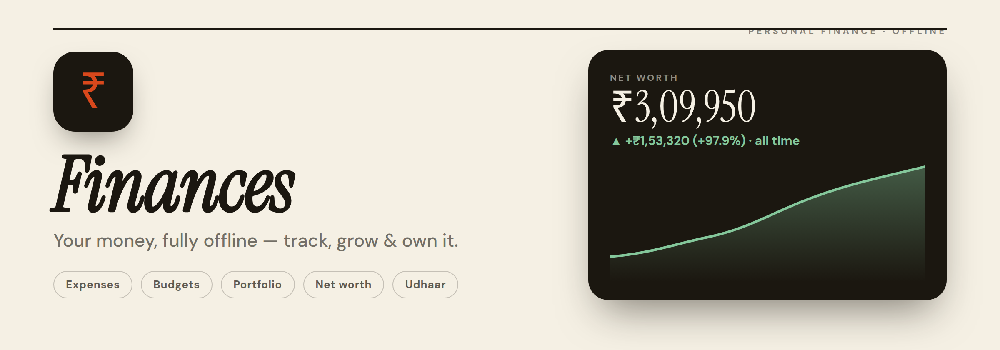
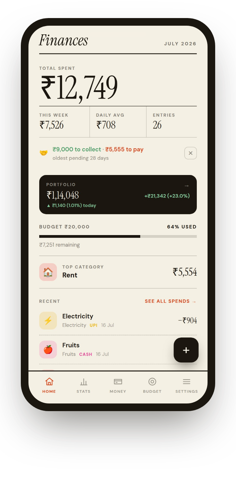
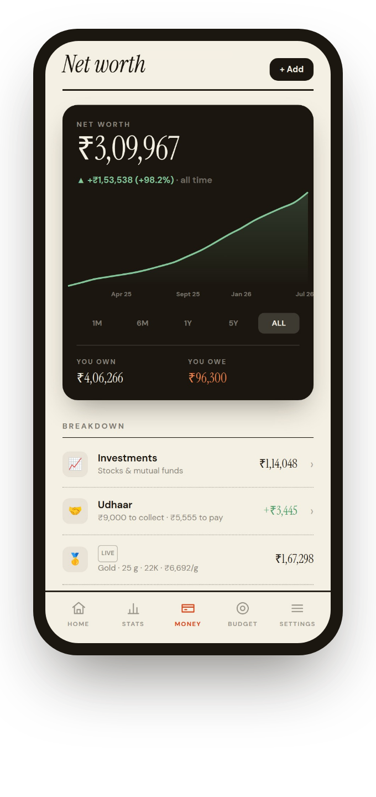
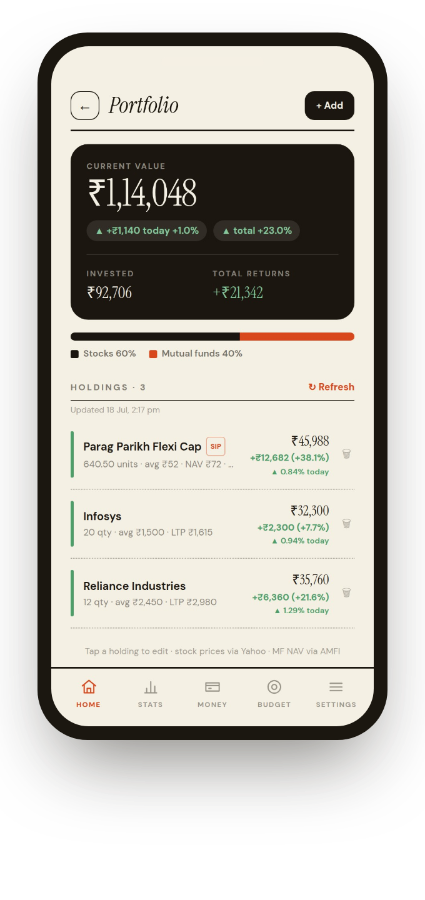
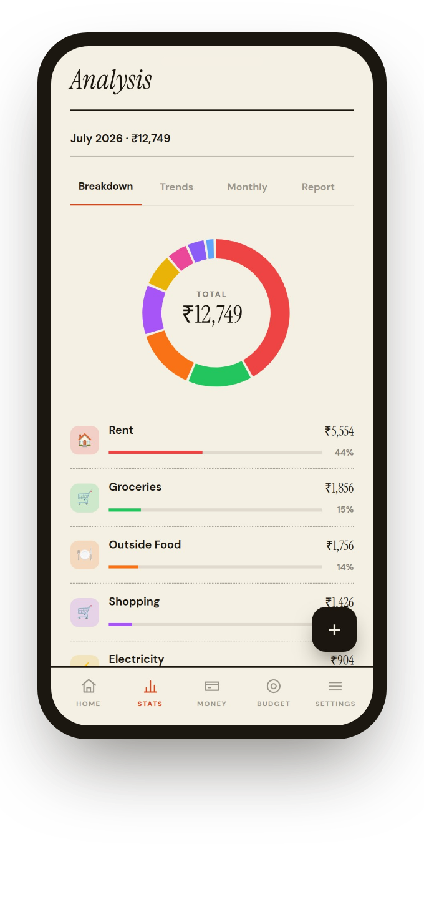
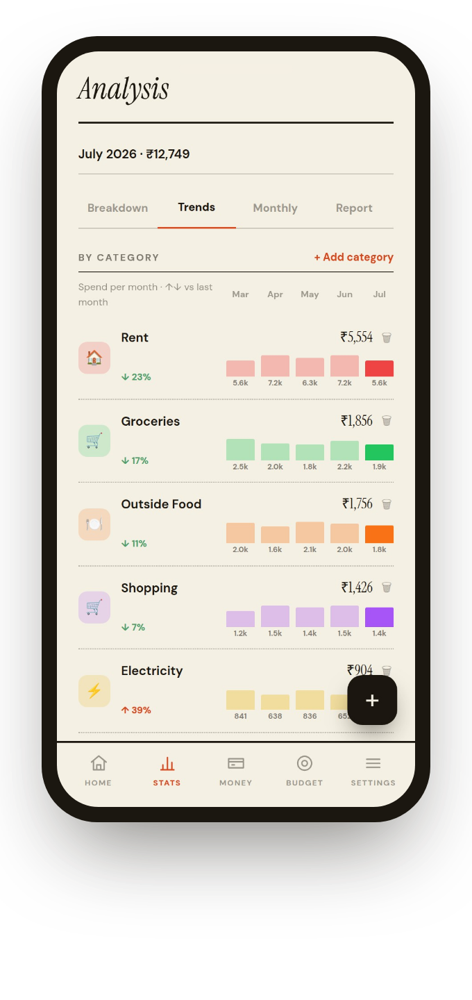
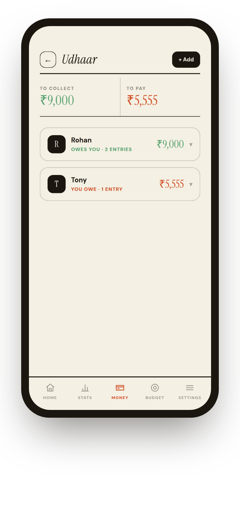

<div align="center">



<br/><br/>

An offline-first personal finance app: track spending, budgets, investments, gold &amp; loans, lending, and your whole net worth — with **zero accounts, zero cloud, zero tracking.** Everything lives in your phone's local storage.

<br/>


</div>

---

## 📱 Screens

<div align="center">
<table>
  <tr>
    <td align="center"><br/><b>Home</b><br/><sub>Spend · budget · portfolio</sub></td>
    <td align="center"><br/><b>Net worth</b><br/><sub>Everything you own & owe</sub></td>
    <td align="center"><br/><b>Portfolio</b><br/><sub>Live stocks & mutual funds</sub></td>
  </tr>
  <tr>
    <td align="center"><br/><b>Breakdown</b><br/><sub>Where money goes</sub></td>
    <td align="center"><br/><b>Trends</b><br/><sub>Category, month over month</sub></td>
    <td align="center"><br/><b>Udhaar</b><br/><sub>Who owes you & you owe</sub></td>
  </tr>
</table>
</div>

---

## ✨ Features

### 🧾 Track
- One-tap expense logging with categories, notes, payment type
- **Salary-day months** — your month can start on payday, not the 1st
- Monthly & per-category **budgets** with live progress
- Search, filter and sort your full spend history

### 📊 Understand
- **Breakdown** — category donut for any month
- **Trends** — per-category spend across the last 5 months
- **Monthly** — 6-month bar chart with average line
- **Report** — safe-to-spend a day, a *this-month-vs-last* race chart, spending-calendar heatmap, category-budget alerts, and the little repeat purchases that add up

### 📈 Grow
- **Portfolio** — add stocks & mutual funds, **live prices** (Yahoo Finance + AMFI NAV), weighted-average buy price, allocation split
- **Recurring SIPs** that auto-add units each month at that month's NAV
- **Net worth hub** — one number for everything you own and owe, with a **stock-app-style trend chart** (1M · 6M · 1Y · 5Y · ALL)
- **Live-valued assets**: gold / silver / platinum by weight, **auto-compounding FDs**, **amortizing loans**

### 🤝 Lend & borrow
- **Udhaar ledger** — track who owes you and who you owe, netted per person, with settle-up and history

### 🔒 Secure & portable
- **App lock** with 4-digit PIN + optional **fingerprint unlock**
- **JSON backup & restore**, CSV export
- **Welcome tour** with a *"try with sample data"* demo mode that auto-clears after a day

### 🛡️ Private by design
- **100% offline** — no accounts, no servers, no analytics
- All data in **IndexedDB** on the device; the only network calls are optional market-price lookups

---

## 🛠️ Tech Stack

| Layer | Technology |
|-------|-----------|
| Frontend | React 18 + Vite 5 |
| Styling | TailwindCSS 3 (editorial "paper" theme) |
| Charts | Recharts 2 |
| Storage | IndexedDB via [`idb`](https://github.com/jakearchibald/idb) |
| Mobile | Capacitor 6 (Android) |
| Market data | Yahoo Finance (stocks/metals) · mfapi.in / AMFI (MF NAV) |
| Biometrics | `@aparajita/capacitor-biometric-auth` |

---

## 🚀 Quick Start (Web / Development)

```bash
npm install      # install dependencies
npm run dev      # start dev server → http://localhost:5173
```

> Stock & metal prices and fingerprint unlock are native-only (blocked by CORS / no hardware in a browser). Everything else — including mutual-fund NAV — works in the browser.

## 📦 Build the Android APK

**Prerequisites:** Node 18+, JDK 17+, Android SDK (API 34).

```bash
npm run build                 # 1. build the web bundle
npx cap sync android          # 2. copy web assets + register plugins
cd android && ./gradlew assembleDebug   # 3. build the APK
```

The APK lands at `android/app/build/outputs/apk/debug/app-debug.apk`.

App ID: `com.personal.expensetracker` · Display name: **Finances**

---

## 🗄️ Data Model

Everything is stored locally in IndexedDB — no data ever leaves the device.

| Store | Purpose |
|-------|---------|
| `expenses` | Every expense (bucketed into financial months) |
| `categories` | Category definitions (icon + colour) |
| `budgets` | Monthly & per-category budgets |
| `udhaar` | Lend / borrow entries per person |
| `holdings` | Stocks & mutual funds (+ SIP config) |
| `assets` | Net-worth items: metals, FDs, loans, other |
| `networth_snaps` | One daily net-worth snapshot → the trend chart |
| `settings` | Preferences, cached prices, PIN hash, flags |

Financial-month logic re-buckets every expense from its date, so changing your salary day is always safe.

---

## 📁 Project Structure

```
src/
├── components/
│   ├── expenses/       # expense card + form
│   ├── insights/       # Report tab
│   ├── layout/         # bottom nav
│   ├── onboarding/     # welcome tour
│   ├── security/       # PIN + biometric lock
│   └── ui/             # modal, etc.
├── context/AppContext.jsx   # global state + all actions
├── pages/              # Dashboard, Expenses, Analytics, Budget,
│                       # Settings, Portfolio, NetWorth, Udhaar
├── services/           # db (IndexedDB), marketData, export, notifications, biometrics
└── utils/              # formatters, report, networth, demoData, sampleData
```

---

## 🔐 Privacy

No sign-up. No backend. No telemetry. The app makes network requests **only** to fetch live investment/metal prices, and only when you hold something priced. Your expenses, budgets, balances and PIN never leave your phone.

---

## 📄 License

[MIT](LICENSE) — free to use, modify and share.

<div align="center"><sub>Built with Claude Code · 100% on-device</sub></div>
