<div align="center">

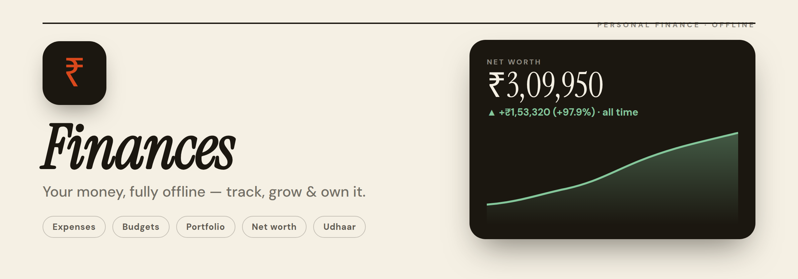

<br/><br/>

An offline-first personal finance app: track spending, budgets, investments, gold &amp; loans, lending, and your whole net worth — with **zero accounts, zero cloud, zero tracking.** Everything lives in your phone's local storage.

<br/>


</div>

---

## 📱 Screens

<div align="center">
<table>
  <tr>
    <td align="center">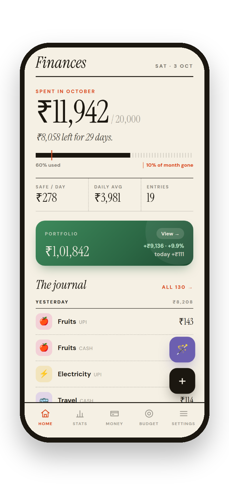<br/><b>Home</b><br/><sub>Budget, journal & portfolio</sub></td>
    <td align="center">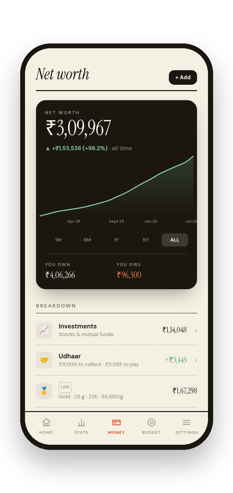<br/><b>Net worth</b><br/><sub>Everything you own & owe</sub></td>
    <td align="center">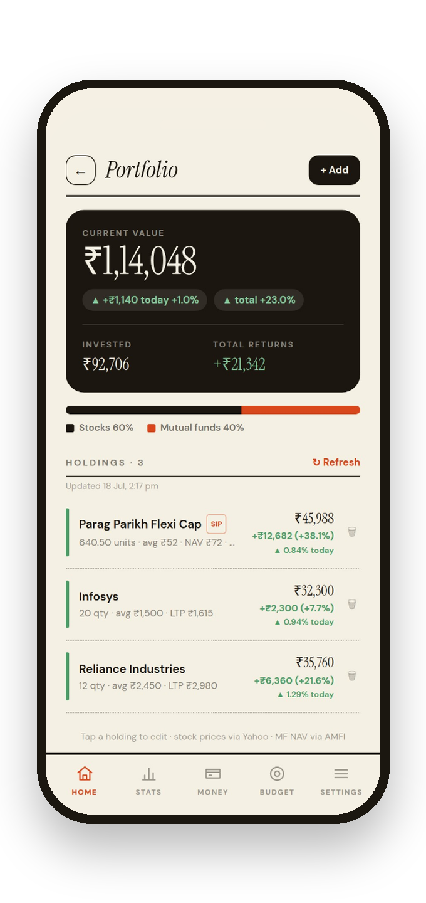<br/><b>Portfolio</b><br/><sub>Live stocks & mutual funds</sub></td>
  </tr>
  <tr>
    <td align="center">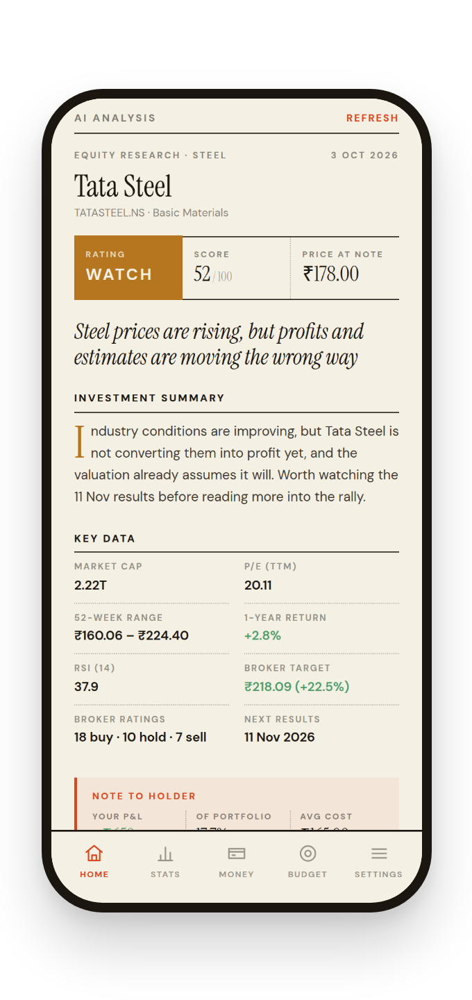<br/><b>Stock analysis 🔬</b><br/><sub>A research note on demand</sub></td>
    <td align="center">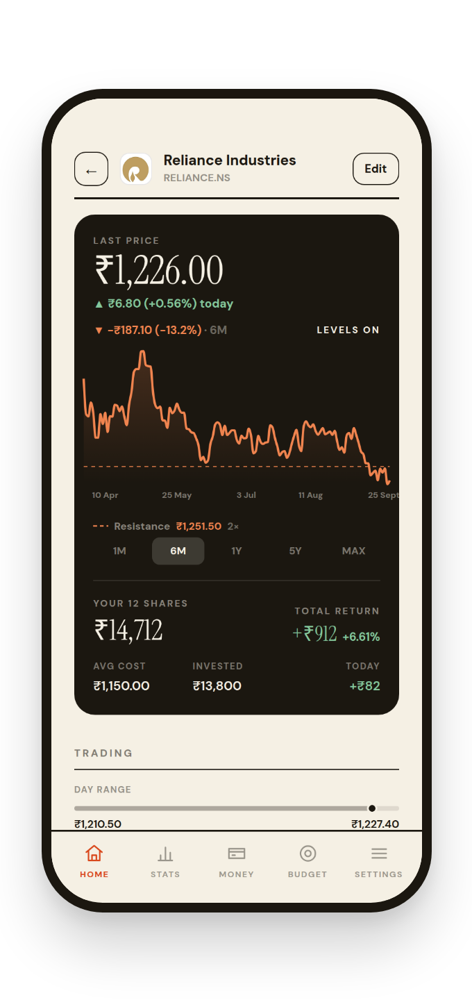<br/><b>Holding detail</b><br/><sub>Chart, levels, your position</sub></td>
    <td align="center">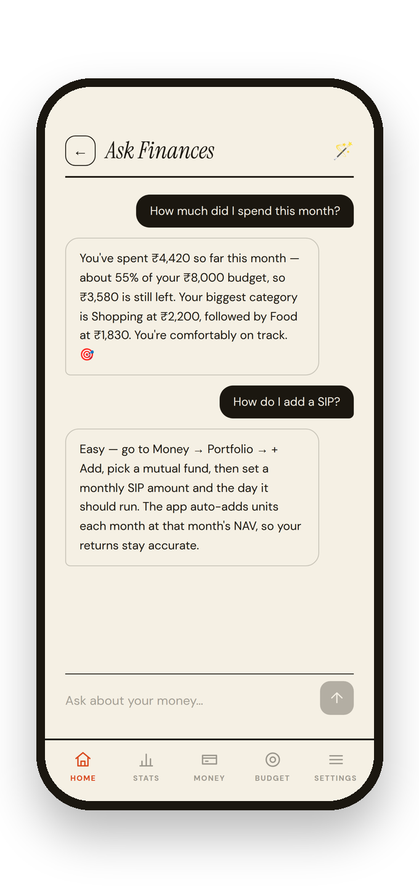<br/><b>Ask Finances 🪄</b><br/><sub>AI: your money & the app</sub></td>
  </tr>
  <tr>
    <td align="center">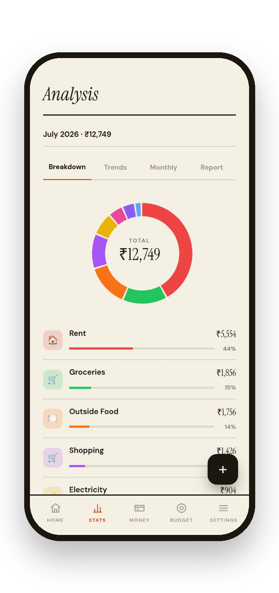<br/><b>Breakdown</b><br/><sub>Where money goes</sub></td>
    <td align="center">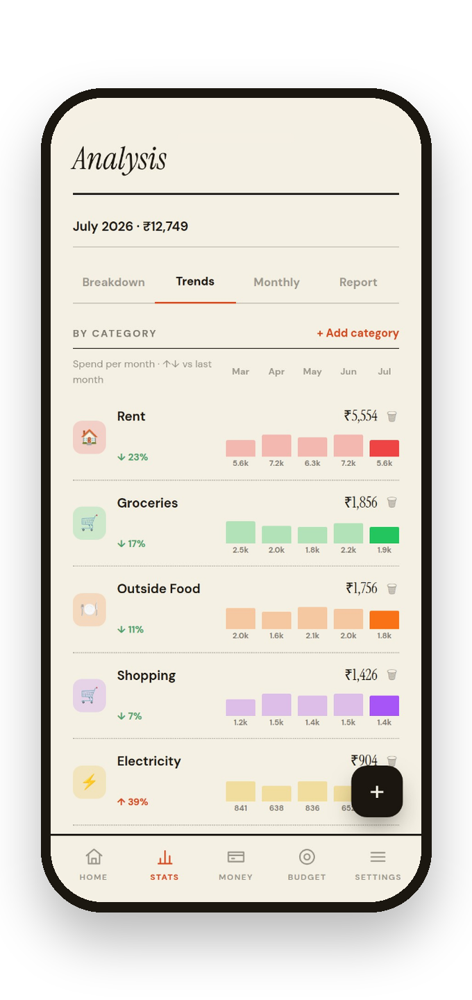<br/><b>Trends</b><br/><sub>Category, month over month</sub></td>
    <td align="center">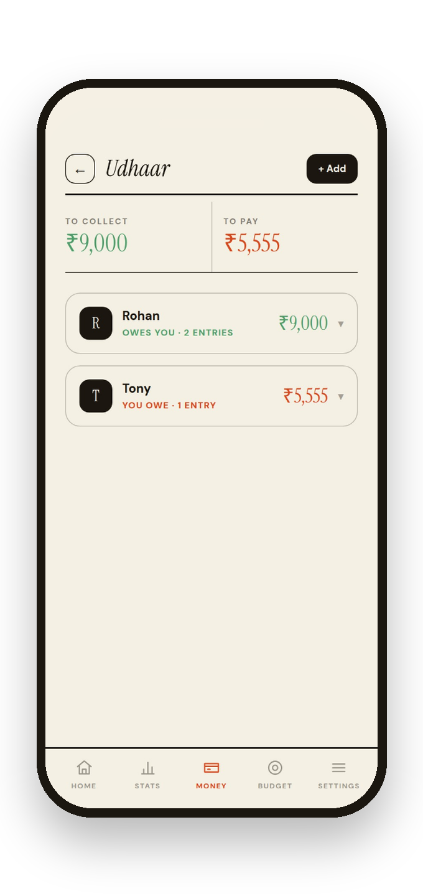<br/><b>Udhaar</b><br/><sub>Who owes you & you owe</sub></td>
  </tr>
</table>
</div>

---

## 🔬 How stock analysis works

One tap builds a full research report. Steps 1–6 run **on the phone, for free**: every number is fetched or computed in code. The AI is called **once**, at the end, only to read the finished numbers and write the report, so it can't invent figures and a report costs under ₹1.

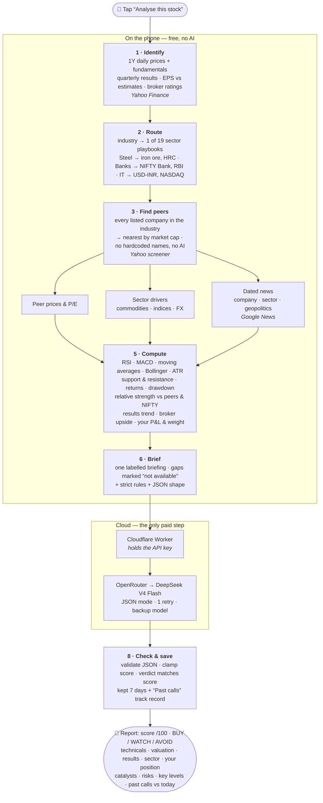
```mermaid
flowchart TD
    A([📱 Tap “Analyse this stock”]) --> B

    subgraph PHONE["On the phone — free, no AI"]
        B["<b>1 · Identify</b><br/>1Y daily prices + fundamentals<br/>quarterly results · EPS vs estimates · broker ratings<br/><i>Yahoo Finance</i>"]
        B --> C["<b>2 · Route</b><br/>industry → 1 of 19 sector playbooks<br/>Steel → iron ore, HRC · Banks → NIFTY Bank, RBI · IT → USD-INR, NASDAQ"]
        C --> D["<b>3 · Find peers</b><br/>every listed company in the industry<br/>→ nearest by market cap · no hardcoded names, no AI<br/><i>Yahoo screener</i>"]
        D --> E1 & E2 & E3
        E1["Peer prices & P/E"]
        E2["Sector drivers<br/>commodities · indices · FX"]
        E3["Dated news<br/>company · sector · geopolitics<br/><i>Google News</i>"]
        E1 & E2 & E3 --> F["<b>5 · Compute</b><br/>RSI · MACD · moving averages · Bollinger · ATR<br/>support & resistance · returns · drawdown<br/>relative strength vs peers & NIFTY<br/>results trend · broker upside · your P&L & weight"]
        F --> G["<b>6 · Brief</b><br/>one labelled briefing · gaps marked “not available”<br/>+ strict rules + JSON shape"]
    end

    G --> H

    subgraph CLOUD["Cloud — the only paid step"]
        H["Cloudflare Worker<br/><i>holds the API key</i>"] --> I["OpenRouter → DeepSeek V4 Flash<br/>JSON mode · 1 retry · backup model"]
    end

    I --> J["<b>8 · Check & save</b><br/>validate JSON · clamp score · verdict matches score<br/>kept 7 days + “Past calls” track record"]
    J --> K([📄 Report: score /100 · BUY / WATCH / AVOID<br/>technicals · valuation · results · sector · your position<br/>catalysts · risks · key levels · past calls vs today])
```

| Step | Where | Code |
|---|---|---|
| Fetch prices, fundamentals, peers, news | Yahoo Finance · Google News | [`marketData.js`](src/services/marketData.js) |
| Pick sector drivers | 19 industry playbooks | [`sectorPlaybook.js`](src/services/sectorPlaybook.js) |
| Indicators & levels | on-device | [`technicals.js`](src/utils/technicals.js) |
| Pipeline, briefing, prompt | on-device | [`stockAnalysis.js`](src/services/stockAnalysis.js) |
| AI proxy | Cloudflare Worker | [`finances-ai-worker.js`](cloudflare-worker/finances-ai-worker.js) |
| 7-day reports & track record | IndexedDB | [`analysisStore.js`](src/services/analysisStore.js) |

---

## ✨ Features

### 🧾 Track
- One-tap expense logging with categories, notes, payment type
- **Salary-day months** — your month can start on payday, not the 1st
- Monthly & per-category **budgets** with live progress
- Search, filter and sort your full spend history

### 📊 Understand
- **Breakdown** — category donut for any month
- **Trends** — per-category spend across the last 5 months
- **Monthly** — 6-month bar chart with average line
- **Report** — safe-to-spend a day, a *this-month-vs-last* race chart, spending-calendar heatmap, category-budget alerts, and the little repeat purchases that add up

### 📈 Grow
- **Portfolio** — add stocks & mutual funds, **live prices** (Yahoo Finance + AMFI NAV), weighted-average buy price, allocation split
- **Holding detail** — live chart (1M · 6M · 1Y · 5Y · MAX) with automatic support & resistance per timeframe, your position, day & 52-week range bars, valuation, financials, and the **analyst view**: consensus, buy/hold/sell split and average target with upside
- **Recurring SIPs** that auto-add units each month at that month's NAV
- **Net worth hub** — one number for everything you own and owe, with a **stock-app-style trend chart** (1M · 6M · 1Y · 5Y · ALL)
- **Live-valued assets**: gold / silver / platinum by weight, **auto-compounding FDs**, **amortizing loans**

### 🔬 AI stock analysis
One tap on any stock holding produces a full research report — score (0–100), verdict (BUY / WATCH / AVOID), and plain-English sections — built from the stock **and its context**:
- **Technicals**, computed on-device: RSI, MACD (and when it crossed), 20/50/200-day averages, Bollinger bands, ATR, swing-pivot support & resistance, returns, drawdown, volume spikes
- **Sector-aware inputs** — each industry pulls what actually drives it: iron ore & steel futures for steel, NIFTY Bank & RBI news for banks, USD-INR & NASDAQ for IT, crude for oil & autos (19 industries mapped)
- **Real competitors, size-matched** — peers are discovered live from the full list of listed companies in the same industry and picked by nearest market cap, so a small finance bank is compared with its equals, not with HDFC Bank
- **Quarterly results** — revenue & profit trend, margins, EPS beats/misses vs estimates, next results date
- **Dated news** — company, sector and geopolitical headlines, each with its age, so old news isn't read as current
- **Your position** — your P&L, how much of your portfolio it is, and reference levels
- **Saved for a week, with a track record** — reopen a stock and the report is still there; every call is logged with its price, so you can see how past verdicts actually played out
- Every number comes from the app, not the model — the AI only weighs it up and writes it. Research and education, not investment advice.

### 🪄 Ask Finances (AI)
- **Ask anything** — a chat assistant that answers questions about your money (*"Am I over budget?"*, *"How much on food this month?"*) or how the app works (*"How do I add a SIP?"*)
- **AI Recap** — a one-tap friendly summary of your month on the Stats page
- **Numbers stay honest** — every figure is computed on-device and handed to the model as a finished total, so it phrases and explains but never does the math
- **No API key in the app** — requests go through a Cloudflare Worker proxy; the model provider key lives server-side
- **Opt-in, on by default** — a data summary leaves the device *only* when you tap Ask or Recap; toggle it off anytime in Settings

### 🤝 Lend & borrow
- **Udhaar ledger** — track who owes you and who you owe, netted per person, with settle-up and history

### 🔒 Secure & portable
- **App lock** with 4-digit PIN + optional **fingerprint unlock**
- **JSON backup & restore**, CSV export
- **Welcome tour** with a *"try with sample data"* demo mode that auto-clears after a day

### 🛡️ Private by design
- **Offline-first** — no accounts, no servers, no analytics
- All data in **IndexedDB** on the device; network calls are limited to market prices & news and — only when you use them — the AI features

---

## 🛠️ Tech Stack

| Layer | Technology |
|-------|-----------|
| Frontend | React 18 + Vite 5 |
| Styling | TailwindCSS 3 (editorial "paper" theme) |
| Charts | Recharts 2 |
| Storage | IndexedDB via [`idb`](https://github.com/jakearchibald/idb) |
| Mobile | Capacitor 6 (Android) |
| Market data | Yahoo Finance (stocks/metals) · mfapi.in / AMFI (MF NAV) |
| AI | DeepSeek V4 Flash via OpenRouter, behind a Cloudflare Worker proxy (no key in the app) |
| News | Google News RSS (India) |
| Biometrics | `@aparajita/capacitor-biometric-auth` |

---

## 🚀 Quick Start (Web / Development)

```bash
npm install      # install dependencies
npm run dev      # start dev server → http://localhost:5173
```

> Stock & metal prices and fingerprint unlock are native-only (blocked by CORS / no hardware in a browser). Everything else — including mutual-fund NAV — works in the browser.

## 📦 Build the Android APK

**Prerequisites:** Node 18+, JDK 17+, Android SDK (API 34).

```bash
npm run build                 # 1. build the web bundle
npx cap sync android          # 2. copy web assets + register plugins
cd android && ./gradlew assembleDebug   # 3. build the APK
```

The APK lands at `android/app/build/outputs/apk/debug/app-debug.apk`.

App ID: `com.personal.expensetracker` · Display name: **Finances**

---

## 🗄️ Data Model

Everything is stored locally in IndexedDB — no data ever leaves the device.

| Store | Purpose |
|-------|---------|
| `expenses` | Every expense (bucketed into financial months) |
| `categories` | Category definitions (icon + colour) |
| `budgets` | Monthly & per-category budgets |
| `udhaar` | Lend / borrow entries per person |
| `holdings` | Stocks & mutual funds (+ SIP config) |
| `assets` | Net-worth items: metals, FDs, loans, other |
| `networth_snaps` | One daily net-worth snapshot → the trend chart |
| `settings` | Preferences, cached prices, PIN hash, flags |

Financial-month logic re-buckets every expense from its date, so changing your salary day is always safe.

---

## 📁 Project Structure

```
src/
├── components/
│   ├── ai/             # AI recap card
│   ├── expenses/       # expense card + form
│   ├── insights/       # Report tab
│   ├── layout/         # bottom nav
│   ├── onboarding/     # welcome tour
│   ├── portfolio/      # holding detail, news, AI stock-analysis card
│   ├── security/       # PIN + biometric lock
│   └── ui/             # modal, etc.
├── context/AppContext.jsx   # global state + all actions
├── pages/              # Dashboard, Expenses, Analytics, Budget, Settings,
│                       # Portfolio, NetWorth, Udhaar, AskFinances
├── services/           # db (IndexedDB), marketData, aiClient, aiContext, stockAnalysis,
│                       # sectorPlaybook, export, notifications, biometrics
└── utils/              # formatters, report, networth, technicals, demoData, sampleData
cloudflare-worker/      # AI proxy — holds the OpenRouter key server-side
scripts/                # dev-only Playwright probes for the stock-analysis pipeline
```

---

## 🔐 Privacy

No sign-up. No backend for your data. No telemetry. Your expenses, budgets, balances and PIN live in IndexedDB on your phone.

The app makes network requests in just a few cases: to fetch live investment/metal prices and market news (only when you hold something priced), and — if you use the AI features — to the AI assistant:
- **Ask Finances / AI Recap** send a summary of your data (aggregates + recent transactions).
- **Stock analysis** sends public market data for that stock plus your position in it (quantity, average cost, share of portfolio) — nothing about your spending.

All AI features are clearly labelled in Settings and can be turned off; nothing is sent unless you tap Ask, Recap or Analyse.

---

## 📄 License

[MIT](LICENSE) — free to use, modify and share.

<div align="center"><sub>Built with Claude Code · 100% on-device</sub></div>
